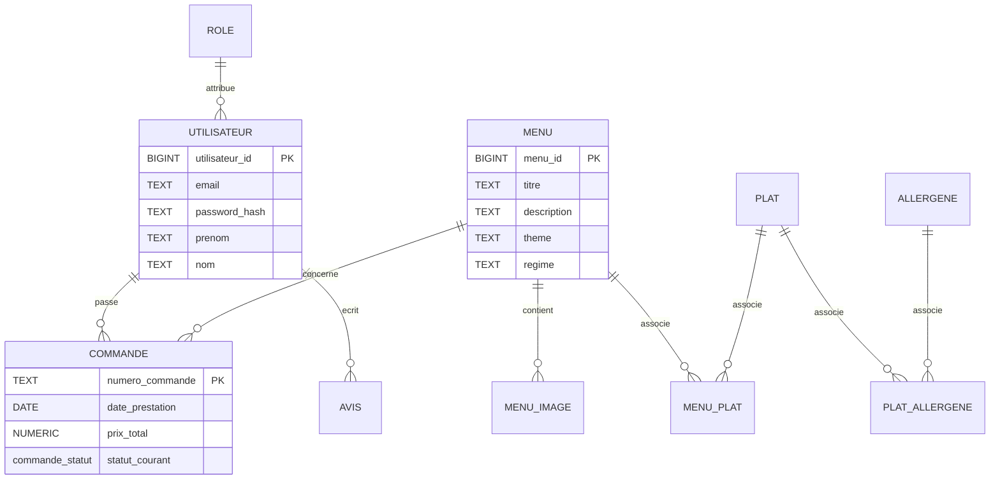
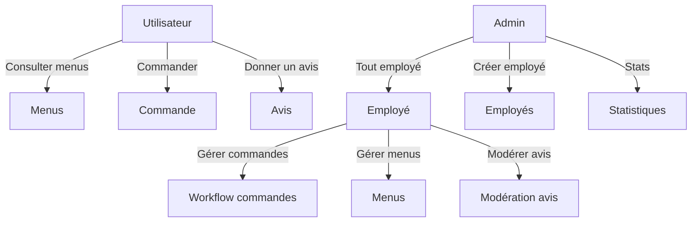
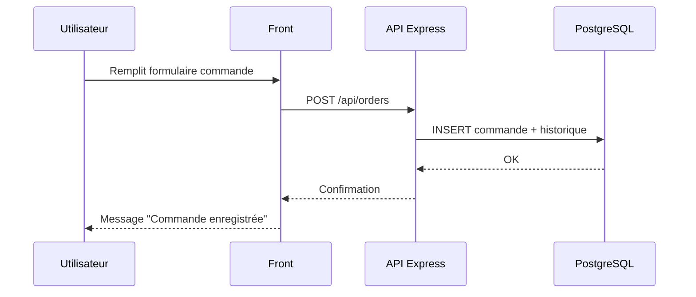

# Documentation technique — Vite & Gourmand (ECF)

## 1. Réflexions initiales (choix technologiques)
- **Front** : HTML/CSS/JS (Bootstrap) pour simplicité et rapidité.
- **Back** : Node.js + Express pour API REST claire.
- **BD relationnelle** : PostgreSQL (transactions, intégrité).
- **BD NoSQL** : MongoDB (stats commandes par menu).
- **Auth** : JWT + bcrypt.

## 2. Configuration de l’environnement
Pré-requis :
- Node.js (LTS), npm
- PostgreSQL
- (Optionnel) MongoDB

Variables d’environnement (`backend/.env`) :
```
PORT=3001
DATABASE_URL=postgres://USER@localhost:5432/vite_gourmand_clean
JWT_SECRET=une_phrase_secrete
MONGO_URL=mongodb://localhost:27017
MONGO_DB=vite_gourmand
```

## 3. Modèle conceptuel de données (MCD)



## 4. Diagramme d’utilisation (Use Case)



## 5. Diagramme de séquence (commande)



## 6. Déploiement
Voir `docs/DEPLOYMENT.md` pour le détail.

## 7. Sécurité
Voir `docs/SECURITE.md`.
